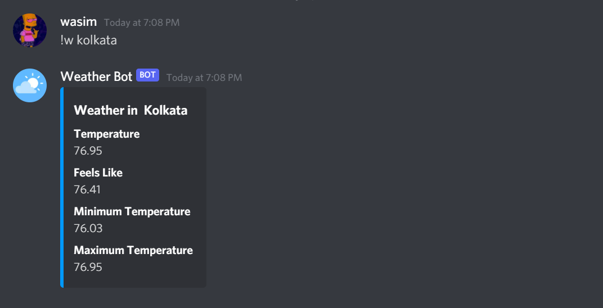

<h1 align="center">Weather Bot</h1>
<p align="center">
   
   
</p>

## About The Project

A discord weather bot that displays weather information of a given city.

<p>
    
</p>

## Resources and APIs

- Python 3.9.9
- Python Discord.py module
- OpenWeatherMap API 
- Discord API

## How to setup

1. Create a discord bot [here](https://discordapp.com/developers/applications/me) and grab the token.

2. We are going to be using [OpenWeatherMap](https://openweathermap.org/api) API, which requires an API key, you can get one for free by simple logging in to their website.

2. Open the **main.py** file and replace your `DISCORD_BOT_TOKEN` and `OPEN_WEATHER_MAP_API_KEY`.

```py
token = 'DISCORD_BOT_TOKEN'
api_key = 'OPEN_WEATHER_MAP_API_KEY'
```

3. Before running the bot you will need to install all the requirements with this command:

```
pip install -r requirements.txt
```

4. Start the bot by having the cmd/terminal inside the bot folder and run the following command:

```
python3 main.py
```

5. You're done, enjoy your bot!
